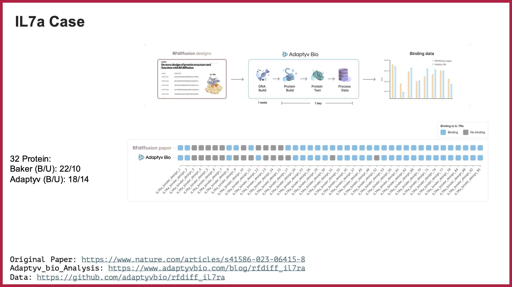
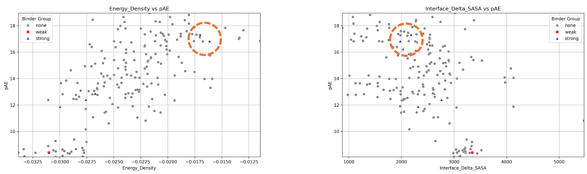

# The Question!
---
##### Semi-Private | S.Alireza Hashemi

 
After the first-round results were announced, we met with (@Kave_nasr) to tackle the following question: Could we establish a single metric—or a combination of metrics—that reliably indicates binding confidence among the top-ranked candidates?
Drawing on data from the IL-7a case study and all 201 sequences from the first round, we predicted each structure, took the top-ranked (rank 1) model, and then applied the Rosetta Score function and interface-analyzer (as used by Vasquez and Kuhlman) to seek meaningful correlations. (All structures underwent the fast-relax protocol, in parallel with AF2, to gain some computational advantages over AF2 relaxation.)
Below are a few of the plots exploring an assumed correlation between iPAE and X, where X includes:

•	Interface energy

•	Hbond energy

•	Interface SASA

•	Number of Interface Residues

•	Complexed Energy

•	Complexed SASA

•	Side_Score

•	Hydrophobic Interactions

•	Electrostatic_Score

•	Fold_Tree

•	Rotamers_Score

---

IL7a Case:

    •	Baker (B/U): 22/10

    •	Adaptyv (B/U): 18/14

#### --> [📄 Open [IL7a] PDF in New Tab](./IL7A.pdf){:target="_blank"}

{ align=left style="height:;width:550px; margin-top: 0px;" }

  

And as the same procedure for the EGFR case:

---

EGFR (Round1) Case:

    •	201 Protein:
    •	Expressed: 147
    •	(B/U): 7/147

#### --> [📄 Open [EGFR] PDF in New Tab](./EGFR.pdf){:target="_blank"}

---
### Discussion

 

For now, we plan to include other bakers’ work from RFDiffusion and Round 2 of Adaptyv bio, as it helps clarify noise and, importantly, addresses two main points: first, reducing the bias from the large number of successful proteins reported in the RFDiffusion paper, and second, classifying binders by the model or other shared criteria.

For example, if we look at Vázquez’s work and the recommended filters (ddG < -40 & pAE <10), it does help screen out cases that don’t meet those conditions. However, there are two issues:

• Although it effectively filters non-binders, it does not reliably confirm binding confidence.

• For semi-natural binders disqualified in Round 1, these filters did not align with the results.

 
It’s also worth noting that we used highly selective IL-7a data. We are now calculating Round 2 metrics and incorporating more RFDiffusion data to achieve better classification.

### Deviation from correlation observed in natural binders:

