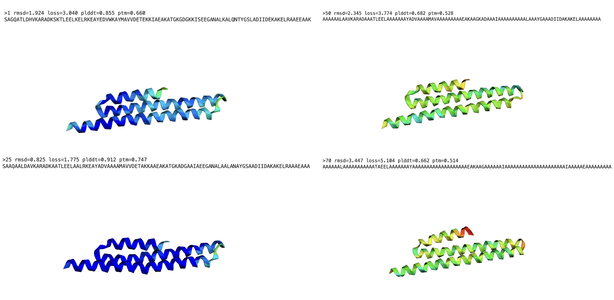
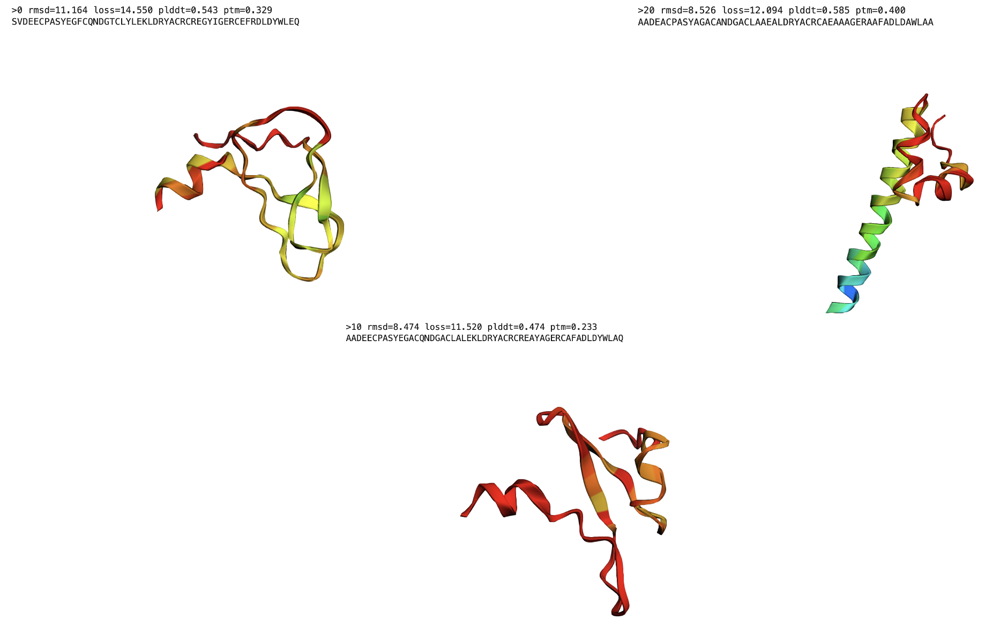
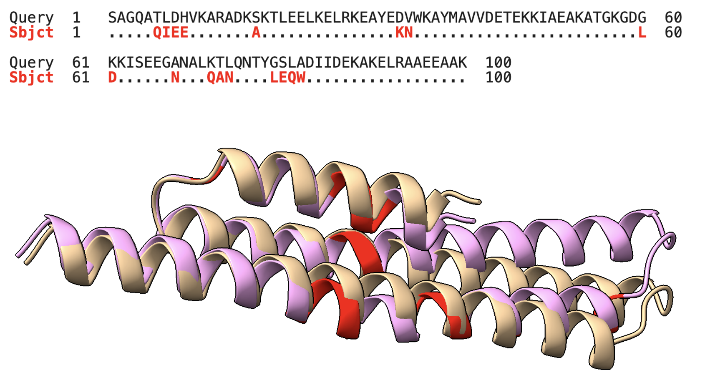
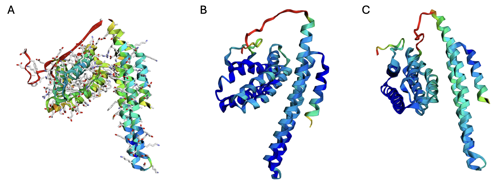

# The Quest!
---
##### Jan | S.Alireza Hashemi

## Overview

 
One of the things that stands out after the Round 2 results were published is how well the “surgey” tool pairs with the test sequences. This tool shows how ineffective AlphaFold or even ESMFold can be in the case of point mutation predictions. Essentially, the tool mutates one residue at a time to alanine (A) and then predicts the structures of these newly mutated sequences. The results indicate a significant mismatch and highlight the model’s tendency to resist changing the structure.  

[X-Link](https://x.com/sokrypton/status/1812769477228200086) - 
[Colab-Link](https://colab.research.google.com/github/sokrypton/ColabBio/blob/main/notebooks/replacement_scan.ipynb)

<figure markdown="span">
  { width="1000" }
  <figcaption> </figcaption>
</figure>
Resist to changing the structure, 1 - 25 - 50 and 75 mutation which performs on Elian sequence make it 
        

       from
    •   SAGQATLDHVKARADKSKTLEELKELRKEAYEDVWKAYMAVVDETEKKIAEAKATGKGDGKKISEEGANALKTLQNTYGSLADIIDEKAKELRAAEEAAK
       to
    •   AAAAAALAAAAAAAAAAATAEELAAAAAAAYAAAAAAAAAAAAAAAAAAKAAGAAAAAAIAAAAAAAAAAAAAAAAAIAAAAAEAAAAAAAA
by keeping the same structure (on 25 mutations even confidence is high)

## Two Key Observations

I tried out some Round 1 and Round 2 models with this tool, and two things caught my attention:

1. **Predicting Authenticity and Bias**  
   Can we predict how genuine these structures are, and how biased they might be?

2. **Meaningful Correlation**  
   Do we see a meaningful correlation here?

 
Answering the second question requires time and effort to evaluate all possibilities. However, in some cases, we observed that structures are more sensitive to mutations. This might suggest that such sequences deviate from the model’s inherent biases. (Perhaps the subset of binders that behave more sensitively in this tool will also prove meaningful.)

<figure markdown="span">
  { width="1000" }
  <figcaption>Sensevity to mutations on alec1 binder sequence, low confidence at start is questionable.</figcaption>
</figure>

## Addressing Potential Biases

 
As for the first issue, we have some ideas. Generally, a high-confidence predicted structure is assumed to be correct, and we often rely on confidence metrics to rank it. But the mutation profile suggests there could be biases coming from both the encoders (MPNN) and the structure prediction models (AF2 and ESM), especially in workflows where sequences are refined, partially diffused, or something similar.

We also tested some mutated sequences on ColabFold-MMSeq and ESM-Fold, comparing their performance with the “surgey” analysis tool (without MSA). The result was striking—25 residues mutated to alanine.

<figure markdown="span">
  { width="1000" }
  <figcaption> x.rustamov-m_18_41 and vs elian.elian3 share 83% sequence similarity. Even though most of the mutations are not in the binding site, it is interesting to see that they still do not bind to the target—despite the predicted structure being very similar. This observation highlights how poorly our models can perform during the refining steps.</figcaption>
</figure>

<figure markdown="span">
  { width="1000" }
  <figcaption> briannaughton.2_plus_1 sequence as a much bigger structure, struture prediction on 20 mutants profile, A) surgey tool B) AF2(Colab-Fold) C) ESMFold(Colab-Fold) </figcaption>
</figure>

## Potential Solutions

 
A potential solution might come from older, physics-based tools—perhaps not for binding but for structure itself. The idea could be as grand as introducing a completely new tool, or as straightforward as using existing tools to evaluate binders before wet-lab tests.

For instance, we can look at the correlation between structure and sequence using physics-based methods. One approach is to run Robetta domain-based predictions and compare them to AF2 predictions to see how much bias might be affecting the predicted model. We could also consider implementing a PyRosetta model with the surgey tool to assess structure accuracy. In principle, we can evaluate ddG from the sequence and structure separately to see if they are compatible.

## Concluding Thoughts

 
Finally, it might be helpful to employ complementary physics-based tools to evaluate the structure on its own. As discussed, the trend of a sequence and its predicted structure should align. There are some well-established tools that predict thermodynamic parameters directly from sequence and structure, showing good efficiency back in the era before ML-based methods.

Now might be the right time to dust off those tools—or even train and fine-tune current models—by incorporating these classical parameters.

