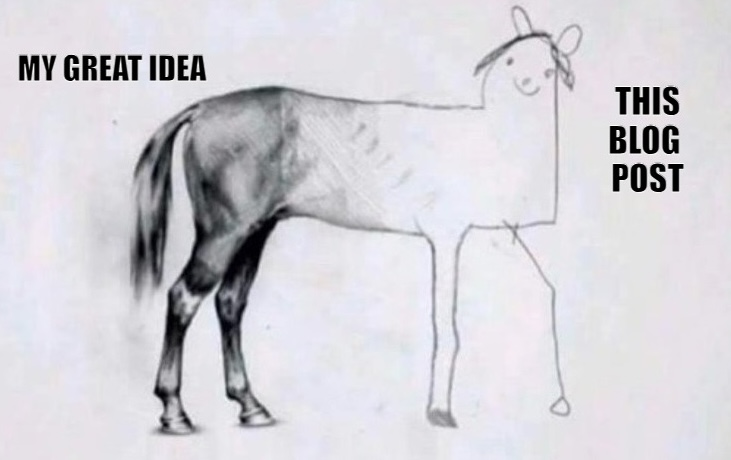
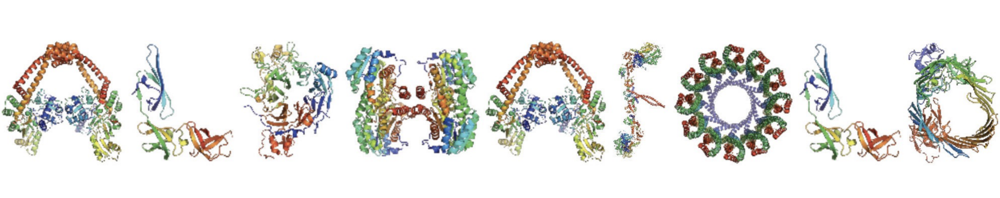
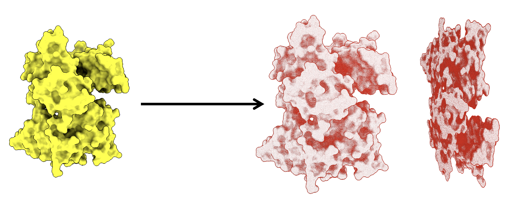

# Picture to PDB
---
##### Jul 19, 2024 | S.Alireza Hashemi

{ align=right style="height:270px;width:; margin-top: 0px;" }

 
Somewhere near last week there was an idea based on diffusion models that came to my mind, it is a simple idea but interesting to implant. 

Diffusion models are used to produce images and a familiar example for us is DALL-E, then Bakerlab introduces RFDiffusin. Based on a recent idea to produce proteins with Diffusion models and have Rosetta’s main core, they deployed their own network called RFDiffusion. This model tries to learn how proteins fold and then based on three-dimensional geometry try to produce a new one, this new protein could be made from scratch with a great degree of freedom, so it could be useful for designing protein folding and proteins in a de-novo form that not exist in nature yet. 
But what is this post about and how it came to my mind? 

{ align=right style="height:;width:1000px; margin-top: 0px;" }

When I see one of those Alpha-Fold slides that tries to write “AlphaFold” with proteins, I think about a bigger picture and reverse the idea of RFDiffusion; instead of creating proteins based on an image processing network, create pictures with proteins. Simply, try to produce as many folds in a PDB scene, which seems to look like an original picture.

But not all you write on a paper is plausible to produce in a single shot try. So right now I am trying to understand PDB files by writing on them and as a simple act, this code transforms pictures to PDB scenarios. 

<figure markdown="span">
  { width="1000" }
  <figcaption>As always, Try to transform RNR(5xgu) image to a PDB Scene</figcaption>
</figure>

# Availability
---
Check out my Github to run it locally: 
[Link](https://github.com/salireza111/Pic-to-PDB/tree/main)

Also you can try it from googlecolab: 
[Link](https://colab.research.google.com/drive/1BzEX78NgD2__R4BDStk7F9MEDTPRDkmV?usp=sharing)

