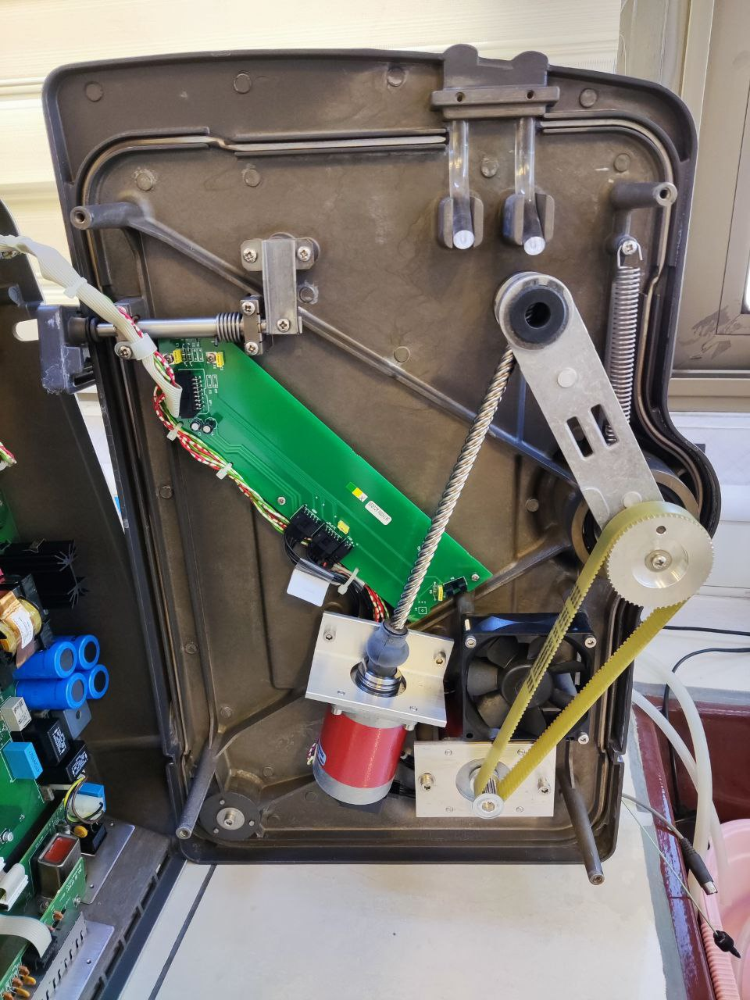
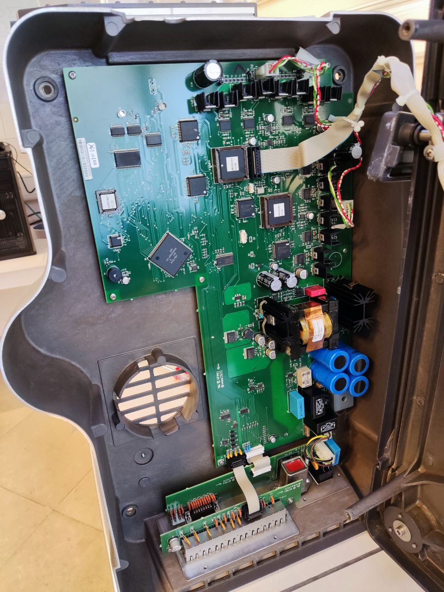

# Frank in back !
---
##### Sep 13, 2024 | S.Alireza Hashemi

 
The main reason behind most inventions, especially FPLC and its components, is to make our lives easier. And by "us," I mean specialists like myself, whose main or side quest is purifying proteins. When you have a tool like this, it’s like holding a gift—sweet freedom in your hands. But when it’s taken away, suddenly, life becomes more complicated than it has any right to be.

Take the Fraction Collector, for example. Last year, when we added it to our FPLC, it revolutionized our workflow. We got comfortable—maybe too comfortable. But then, disaster struck. The old man from the '90s decided to retire early and crashed. Cue the nightmare. With no official office or technician for support, the machine just sat there, collecting more dust than fractions.

But, in the midst of this chaos, curiosity bubbled up inside me like an uncontrollable fire. So, I did what any determined protein enthusiast would do—I cracked it open to see if I could bring it back to life.

HERE IT IS - guys, this is Frank (Frac-950) from inside: 

{ align=left style="height:;width:350px; margin-top: 0px;" }
{ align=left style="height:;width:350px; margin-top: 0px;" }

And this is Frank after surgery:
{ align=left style="height:;width:350px; margin-top: 0px;" }

