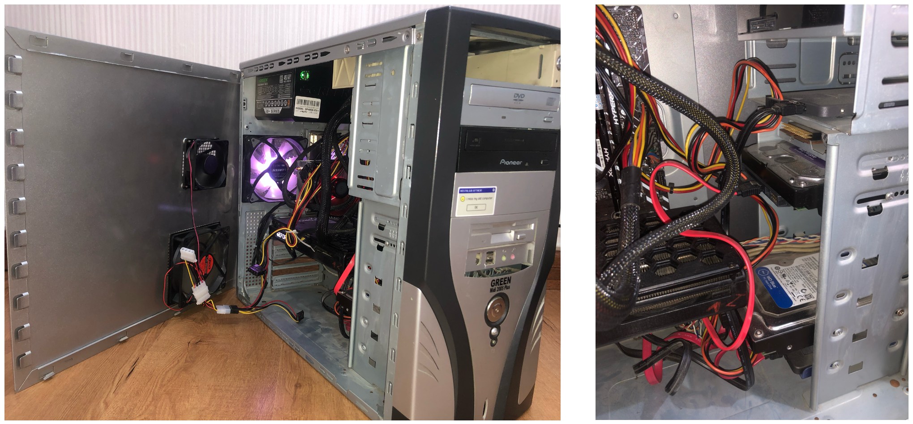
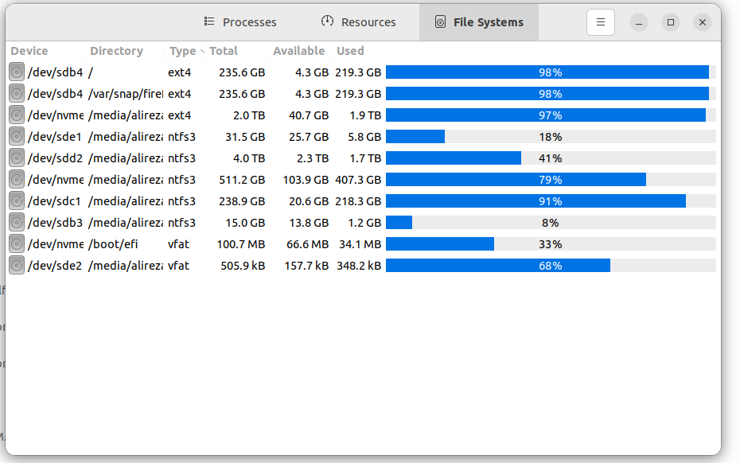

# Old Fashion Frankenstein 🛠️
---
##### Nov 24, 2024 | S.Alireza Hashemi

{ align=right style="height:;width:350px; margin-top: 0px;" }

 
Almost a year ago, after nearly finishing my project on purifying and developing methods to evaluate RNase R (RNR), a challenge stayed on my mind: Besides digesting RNA from the 3’ end, this exonuclease can also act like a helicase, unwinding double-stranded RNA. In this process, RNA enters through a channel, a wedge domain separates the two strands, one strand's 3’ end enters the catalytic site, and the other strand exits through another channel. So, we now know that RNR needs two main channels: one for the substrate to enter and another to guide the 5’ end out.
The unsolved question is the role of each channel—identifying which is for substrate entry and which serves as the outlet duct, which is unsolved by now. Dedicated to solving this, I dive deep into the problem using a method that, looking back, seems quite naive. I tried designing mini binders to block each channel, hoping to see if blocking one would deactivate the enzyme on single or double-stranded RNA. The ultimate goal was to create a mini-binder cocktail capable of inhibiting all kinds of nucleases.

  

 
Among the excitement around the early introduction of RFDiffusion, I rolled up my sleeves and began designing using the Colab version. After designing, validating, and closely inspecting these proteins—with limited knowledge about proteins and protein design tools—I moved on to docking them together. Using H-dock and HADDOCK for local and global docking revealed a conflict: the peptides could occupy both sites at the same time with significant scores.
Meanwhile, eager to understand proteins better, I started a new journey. I decided to pursue a master's in biophysics, and within a year, I immersed myself in protein design literature, focusing especially on the works from the Baker Lab.
Then, at just the right time, Adaptyv Bio (Round 1) was announced. Amid the confusion of various methods and tools, this challenge was exactly what I needed to refine my skills. The first two weeks of the month-long opportunity were spent setting up and downloading tools. If that sounds excessive, consider this daily reality: a combination of sanctions, internal bans, and extremely slow internet speeds.

<figure markdown="span">
  { width="750" }
  <figcaption> Internet Speed and Difficulty of access to some main packages, drivers, and libraries </figcaption>
</figure>

 
After that, I tried to replicate Susana Vazquez's pipeline and explored Longxing Cao's work, who had worked on EGFR before. At this point, I followed some ideas to achieve the lowest possible iPAE on AF2, and after about two weeks, some promising mini peptides appeared on my screen. Despite good iPAE scores, I guessed that these peptides might not be ideal without a scaffold, and keeping their original shapes could be doubtful. To address this, an idea came to me in the final hour before the deadline: stitching sequences together. Inspired by Kuhlman’s work on EvoPro, which created a pool of sequences using crossover ideas, I stitched two of my best peptides with TGF. I looked at the TGF and all my designs to find the best point to break the TGF loop and attach the peptide.

 
But since this was a last-minute idea, I didn't have the chance to test them or check if the spacing was good enough, so I took a leap of faith, sacrificing two peptides to see the result of the stitching method.
After finishing this competition, it was time to prepare for the next one: BioML. Using the same approach, we aimed to design nearly 380 out of 500—the set goal. However, computational limitations prevented us from diving as deep as we wanted, especially in the quality control and filtering parts.
A month later, after having zero successful binding attempts in the first round, the bell rang for the next round of Adaptyv Bio. This time, the focus shifted from just designing good computational proteins to understanding why we didn't have a binder and learning from it. I examined 200 designs from the first round and also validated IL-7Ra in Adaptyv Bio, analyzing it with Rosetta as a physics-based tool and other possible data-driven methods. This data was applied in the filtering step, and since the main workflow wasn't set to get the best metrics for the competition, our ranking this time was far from our best in the first round.

 
This journey allowed me to follow my passion and attempt to design a protein with a real chance of yielding results in the real world. I'm grateful for the last four months of designing and the year spent studying proteins and protein design tools.

As for my setup and conditions—if it looks messy, it's because I had to add two fans during the competitions (CPU temperatures reached 90°C during the relaxation step), replace the CPU fan, and keep adding storage drives. Each addition came monthly as I budgeted for the next upgrade. :)

<figure markdown="span">
  { width="750" }
  <figcaption> Old Fashion Frankenstein 🛠️, 2005 chassis as a body, equipped with a second-hand RTX 3060, with the help of 12100f as a brain. Followed by a lot of fans to keep it not quiet but viable </figcaption>
</figure>

<figure markdown="span">
  { width="750" }
  <figcaption> This mini-monster has housed a range of drives, from an old 2004 Western Digital 256 GB HDD to a modern 2 TB SSD, As a monthly budget system 💾 </figcaption>
</figure>

