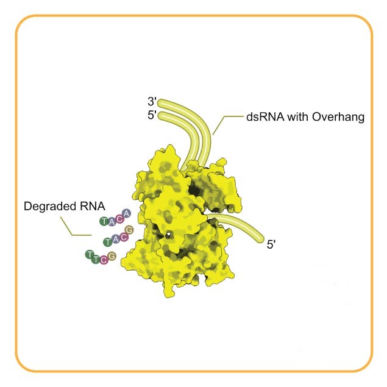

# [3.1.13.1]
---
##### March 01, 2024 | S.Alireza Hashemi

{ align=right style="height:270px;width:; margin-top: 0px;" }

 
RNR, acting as a master sculptor of RNA, "unwind" a new vision for me. Just looks like what it does to an RNA. 
Two years ago, on a day like today, I found myself, a curious traveler, embarking on a new and magical world of science. Now, looking back at the whole picture of these two years, I see RNR as a magical word that entered me and made my entire journey. 
As a newbie! in the field of research and science and as a third-year Bachelor's student, at then I couldn't even imagine such an opportunity to find all those magnificent people and fellow travelers on this path. 
RNR (one of those enzymes that act as an exoribonuclease) formed a new vision for me. And now just before saying goodbye to him, I want to start my blog to write about all of those lessons and thoughts. 
Hopefully, this is helpful to someone out there!

