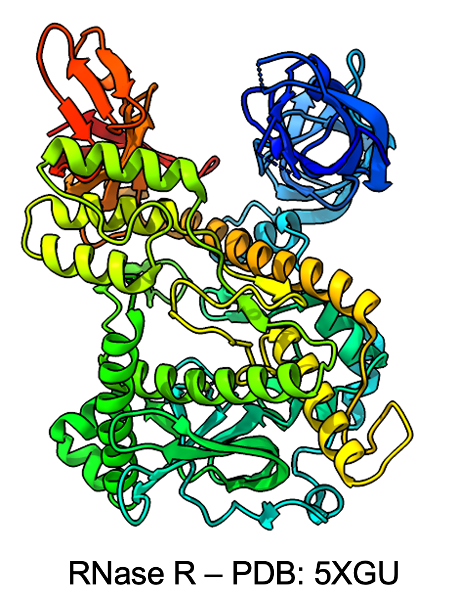

# Kingdoms of Life
---
##### March 03, 2024 | S.Alireza Hashemi

{ align=right style="height:270px;width:; margin-top: 0px;" }

 
Have you ever focused on an eye-catching phenomenon in nature? What makes it so special to survive out there? 

Based on the book "Linchpin" by Seth Godin, in a complex and merciless nature, the one who has an outstanding ability could keep on track; I ask myself every time I face a new opportunity, is there anyone else out there who could do that instead of me? And what is the advantage of me standing there?

RNase R is a conserved enzyme in Kingdoms of Life, but what makes it a linchpin to survive there? In a massive amount of mutations and selections from eternity to eternity. Some other nucleases out there do not make it through evolution, I believe it's just not about the basic ability to be a nuclease, it's all about those traits that play crucial roles in a complex system. The ability to unwind double-stranded RNA, to be a repair man in ribosomal staling, could live in the wild nature of cell cytoplasm as long as the cell needs it and the ability to adapt in different situations when a cell needs it or not. 

What is it all about? Who made this great organization out there? And how amazing is it, to organize such a massive, unpredictable atomic puzzle to form the meaning of Life.

