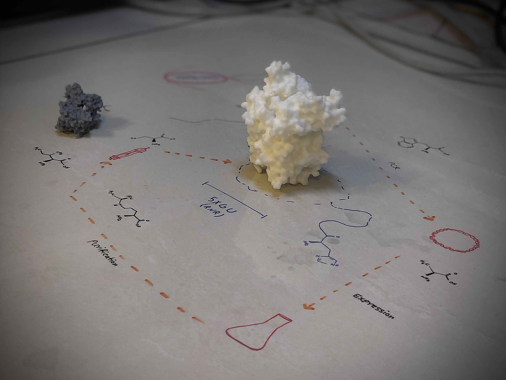

# 5 and 7 zeros
---
##### Mar 3, 2025 | S.Alireza Hashemi

<h2>Just before entering the quarter-century club and turning 25 🥳, a <a href="http://micrograph.studio/">friend</a> surprised me with an awesome gift: 
 
&emsp;A 3D-printed version of RNR, a model that’s 5*107 times bigger (1nm:5cm)! </h2>

 
 

#### P.S. I’ve never felt or seen anything like this before—discovering how incredible proteins are and realizing the tiny scale of life we rely on is mind-blowing.

#### P.S.2 We don’t often get the chance to grasp the huge magnifications—millions of times—needed just to be able to touch something this small. Now all those numbers about microscopy finally make sense in a whole new way. 
#### P.S.3  Feeling it with my eyes closed is amazing too—it makes me think of an AFM :)

