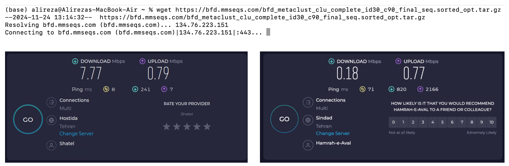
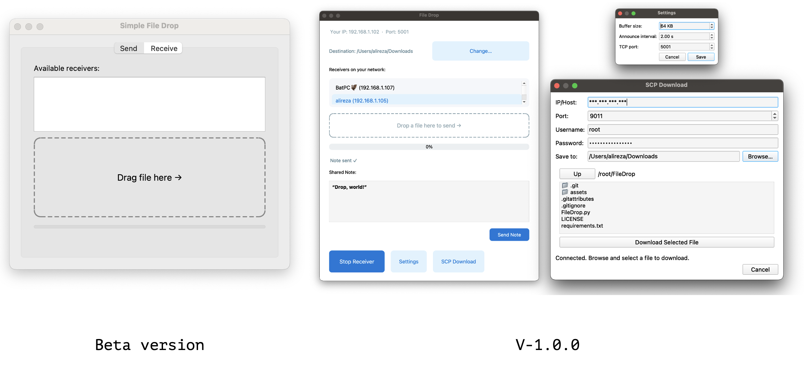

#  FileDrop - Thanks to Mindustry
---
##### Jul 11, 2025 | S.Alireza Hashemi


🎮 Mindustry:
[Link](https://github.com/Anuken/Mindustry)

<div style="text-align: justify"> 
For the last holidays I dove back into Mindustry. I’d played solo before, but this time four of us teamed up over a local session—and wow, it was a blast. It still amazes me how they pack so much detail and smooth play into a 70 MB game.
</div>


#### Cross-platform? ✔️
#### Free to play? ✔️
#### Easy to set up? ✔️


<div style="text-align: justify"> 
Back at work I wanted to bring our four-day campaign onto my own PC. That meant reinstalling the exact build we’d used, then copying the saves. With my snail internet (see earlier posts) that sounded painful. Then I remembered how easily the game connected over LAN—why not move the files the same way?
</div>

#### Manual sharing? Nope.
#### Search around for some tools? Also Nope.



<div style="text-align: justify"> 
So I put together a quick transfer app in PyQt. A few prompts to GPT later and it felt good enough to release. Say hello to FileDrop, a small, cross-platform file-sharing toolkit.
While building it I tacked on a couple of bonuses: sending short notes (handy for mirroring GPT prompts between two machines) and a one-click option to pull files from an SSH server via SCP—to finally scratching that old itch.
</div>




---

## Github: [Link](https://github.com/salireza111/FileDrop)

### Downloads (V1)

| Platform | File |
|----------|------|
| Linux | [FileDrop-linux.tar.gz](https://github.com/salireza111/FileDrop/releases/download/V1.0.0/FileDrop-linux.tar.gz) |
| macOS | [FileDrop-mac.zip](https://github.com/salireza111/FileDrop/releases/download/V1.0.0/FileDrop-mac.zip) |
| Windows | [FileDrop-windows.7z](https://github.com/salireza111/FileDrop/releases/download/V1.0.0/FileDrop-windows.7z) |

## 📦 Install on macOS (Homebrew)

```bash
# Add the tap once
brew tap salireza111/filedrop

# Then install or upgrade any time
brew install --cask filedrop
```
