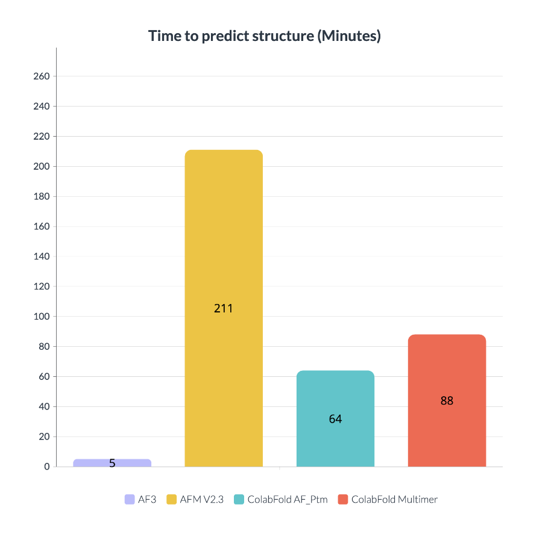
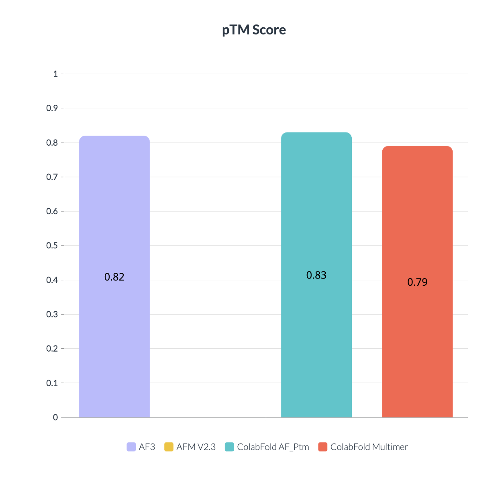
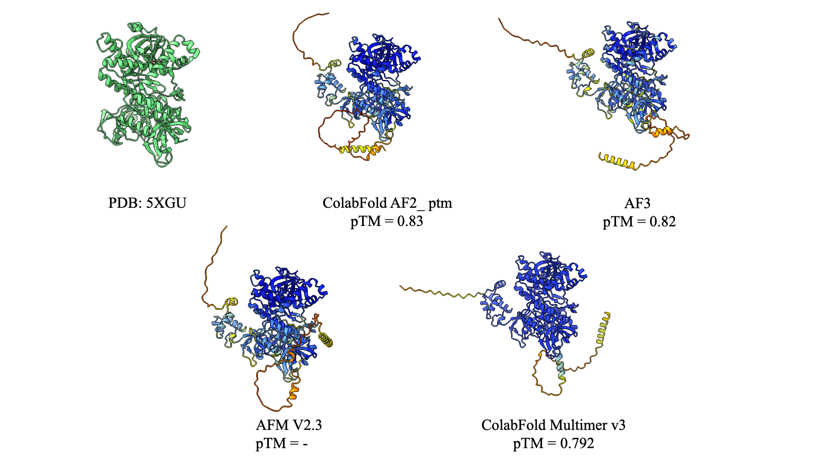
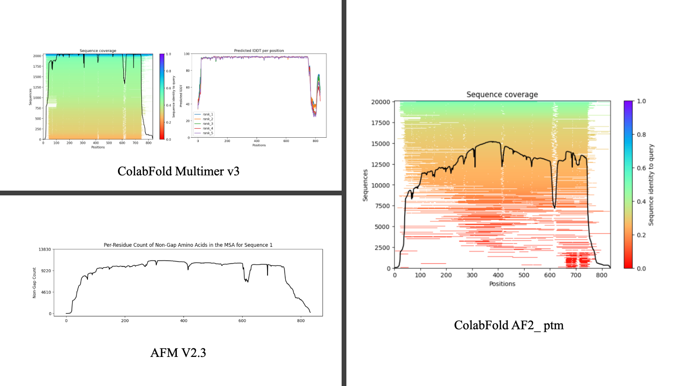

# AlphaFold 3, Is it that impressive?
---
##### May 12, 2024 | S.Alireza Hashemi

 
After AlphaFold3 (AF3) just came out last Wednesday, I've run some benchmarks, and to me, the most remarkable aspect of this model has been its significant speed enhancements.

Deepmind has modified the network of AF3 by adhering to AlphaFold2 architecture, while it contains some crucial changes. One of those changes that caught my attention is about how the model will behave with MSA. (Multiple Sequence Alignment)

AF2 has mostly modified the MSA on 48 blocks of Evoformer along with pair representation. While now on AF3 they have reduced this modification to a single-step module (consisting of 4 blocks) before the main module; Pairformer, which is now performing only on pair representation date.

Obviously, generative models have seen impressive development in recent years, this has taken a place as one of the main changes in AF3 architecture. It is replaced with a "structure module" in AF2. Based on my own understanding of this step, with the help of diffusion models not only AF3 is now capable of modeling the structures of a variety of other atoms such as ligands within the prediction, but also operates significantly faster than the structure module on AF2.

Please read the unedited version of the AF3 article on Nature to address more details. ([Link](https://www.nature.com/articles/s41586-024-07487-w))

 
Here are some quick benchmarks: (Please note that I've run these models on Google Colab basic set-up with mostly basic presets of these models, So they may be not accurate for being a reference, by the way, it's cool for me to look at them to see how much they've changed)

I try to predict RNase R structure from E. coli (PDB: 5XGU_ 833 amino_acids) so basically one of the changes I've decided to make in the default presets is to turn on the template modeling, I've done this because I believe that AF3 maybe used template modeling on it, and based on the webserver we have access to it I can't change this option. For this issue, I will run a novel sequence generated with Protein MPNN at the next step to ensure both models AF3 and AF2 equally could perform well on the structures without initial guesses.

Here I present data from four models:

- AF3 (1)
- AFM V2.3 (2)
- ColabFold AF_Ptm with mmseqs (3)
- ColabFold Multimer V2.3 with mmseqs (4)

<figure markdown="span">
  { width="600" }
  <figcaption>Time to predict structure, Note that installation time on colab is not added to this time. But server setup should be considered. AF3 server not mentioned the setup but all colab predictions run on T4 GPU.</figcaption>
</figure>

<figure markdown="span">
  { width="600" }
  <figcaption>predicted template modeling not provided for AFM colab version.</figcaption>
</figure>

<figure markdown="span">
  { width="750" }
  <figcaption>Comparison of RNase R (5XGU) with  AlphaFold Rank 1 in compared models It's obvious that those models struggled with both C and N terminals. (Predicted models colored by pLDDT) - Rendered by ChimeraX</figcaption>
</figure>

<figure markdown="span">
  { width="750" }
  <figcaption>Comparison of available MSAs
It shows that even with the generative step at AF3 this model acts as same as the other one, It actually doesn't hallucinate for terminals in which there isn't as much data available for it, making it suitable for this kind of error. AF3 was trained on Alpha Fold Multime as a solution for hallucination which makes sense in the last figure on the same predication for terminals.</figcaption>
</figure>

Will be updated ...

Contact with me on my blog or by salireza111@gmail.com

References:

- Mirdita M, Schütze K, Moriwaki Y, Heo L, Ovchinnikov S and Steinegger M. ColabFold: Making protein folding accessible to all.
- Nature Methods (2022) doi: 10.1038/s41592-022-01488-1
- Jumper et al. "Highly accurate protein structure prediction with AlphaFold."
- Nature (2021) doi: 10.1038/s41586-021-03819-2
- Evans et al. "Protein complex prediction with AlphaFold-Multimer."
- biorxiv (2021) doi: 10.1101/2021.10.04.463034v1
- Minkyung et al. "Accurate prediction of protein structures and interactions using a three-track neural network."
- Science (2021) doi: 10.1126/science.abj8754
- Jumper, J., Evans, R., Pritzel, A. et al. Highly accurate protein structure prediction with AlphaFold. Nature 596, 583–589 (2021). https://doi.org/10.1038/s41586-021-03819-2
- Abramson, J., Adler, J., Dunger, J. et al. Accurate structure prediction of biomolecular interactions with AlphaFold 3. Nature (2024). https://doi.org/10.1038/s41586-024-07487-w
- Graphs Rendered by visme.co