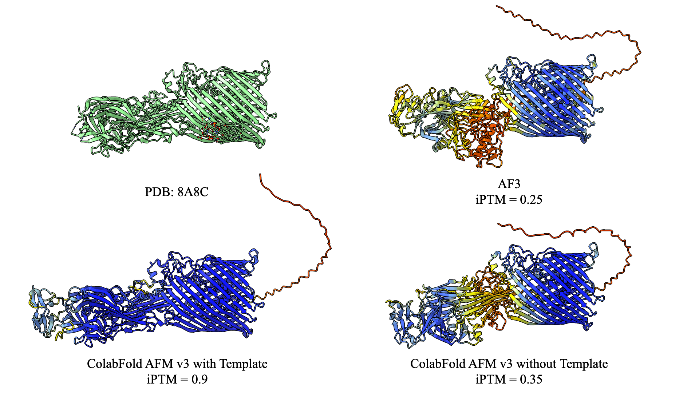
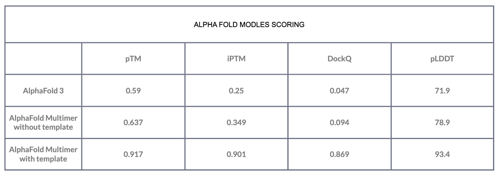

# AlphaFold 3, Docking experiment
---
##### May 15, 2024 | S.Alireza Hashemi

Recently reading an article made me to do an experiment, Björn Wallner introduced a new model, called "AFsample" in one of his latest works[[1](https://www.semanticscholar.org/paper/AFsample%3A-Improving-Multimer-Prediction-with-using-Wallner/62ecf345e9b0143554fdeea053ab89e5bf3d82ed)].

In that article, Wallner discusses his 2022 work on designing protein-peptide complexes [[2](https://www.frontiersin.org/articles/10.3389/fbinf.2022.959160/full)], the potential issues, and their solutions. The main concept behind AFsample is to enhance AlphaFold's accuracy through increased sampling, as getting trapped in local minima could result in thousands of similar structures.

 
Wallner demonstrates that introducing noise and trying to partially interrupt the network could significantly solve the problem, also he reports a massive advancement in the DockQ score of AFsample comparison to AlphaFold multimer. In this test, he used CASP targets to benchmark these two models.

Among the samples in 8 of the cases, AlphaFold Multimer rank-1 predictions couldn't achieve the minimum score of o.23 in DockQ, whereas AFsample achieved a score greater than 0.4 in 6 of those samples.

I found these results interesting to provide a benchmark for AlphaFold3; here I show the model accuracy of AlphaFold3 compared to AlphaFold Multimer and AFsample on a single Docking situation.

H1129 (PDB: 8A8C) was chosen for this test, for which Wallner reported a DockQ score greater than 0.6 for the AFsample. Also, he noted that AlphaFold Multimer couldn't achieve a minimum score of o.23 for this target.

I've tested AlphaFold3, AlphaFold Multimer, and AFM with "Template: PDB100" on this case; Here are the results:

<figure markdown="span">
  { width="600" }
  <figcaption>Comparison Ranked 1 prediction of H1129 (PDB: 8A8C) in AlphaFold3 and AlphaFold Multimer v3 (ColabFold)
(Predicted models colored by pLDDT) - Rendered by ChimeraX</figcaption>
</figure>

<figure markdown="span">
  { width="600" }
  <figcaption>Comparison Ranked 1 prediction of H1129 (PDB: 8A8C) between test models.</figcaption>
</figure>

 
For a quick conclusion; this benchmark shows a massive gap between the situation when there is a template available for our model. (78.9 vs 93.4 in pLDDT score and 0.869 vs 0.094 in DockQ score) Also, AlphaFold3 didn't come up well in this benchmark which questioned my last hypothesis about using the template in this model. 

!!! Tip "Also for calculating pLDDT for AlphaFold3 which is not reported in the AF3 webserver, I've developed this script:"
    https://github.com/salireza111/AlphaFold3_pLDDT
    
Will be updated ...

Contact with me on my blog or by salireza111@gmail.com

References:

- Mirdita M, Schütze K, Moriwaki Y, Heo L, Ovchinnikov S and Steinegger M. ColabFold: Making protein folding accessible to all.
- Nature Methods (2022) doi: 10.1038/s41592-022-01488-1
- Jumper et al. "Highly accurate protein structure prediction with AlphaFold."
- Nature (2021) doi: 10.1038/s41586-021-03819-2
- Evans et al. "Protein complex prediction with AlphaFold-Multimer."
- biorxiv (2021) doi: 10.1101/2021.10.04.463034v1
- Minkyung et al. "Accurate prediction of protein structures and interactions using a three-track neural network."
- Science (2021) doi: 10.1126/science.abj8754
- Jumper, J., Evans, R., Pritzel, A. et al. Highly accurate protein structure prediction with AlphaFold. Nature 596, 583–589 (2021). https://doi.org/10.1038/s41586-021-03819-2
- Abramson, J., Adler, J., Dunger, J. et al. Accurate structure prediction of biomolecular interactions with AlphaFold 3. Nature (2024). https://doi.org/10.1038/s41586-024-07487-w
- Graphs Rendered by visme.co
- Wallner, Björn. “AFsample: Improving Multimer Prediction with AlphaFold using Aggressive Sampling.” bioRxiv (2023): n. pag.
- Johansson-Åkhe I and Wallner B (2022) Improving peptide-protein docking with AlphaFold-Multimer using forced sampling. Front. Bioinform. 2:959160. doi: 10.3389/fbinf.2022.959160
- https://github.com/salireza111/AlphaFold3_pLDDT

